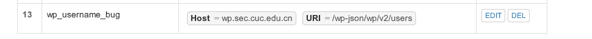

# web服务器

## 环境安装

* 端口配置
  * nginx：80
  * verynginx：8000
  * dvwa和wordpress配置在nginx下


* [nginx、php、mysql、php-fpm等安装](https://www.digitalocean.com/community/tutorials/how-to-install-linux-nginx-mysql-php-lemp-stack-in-ubuntu-16-04)

* verynginx

  * ```bash
    git clone https://github.com/alexazhou/VeryNginx.git
    python install.py install
    # error: the HTTP rewrite module requires the PCRE library.
    apt install libpcre3 libpcre3-dev libssl-dev build-essential
    ```

  * 

  * 启动

    * 报错
    * 
    * 查看端口占用情况
      * `netstat -ntpl`
      * 
      * `kill 14135`
      * 重新启动
        * 由于开启代理导致使用chrome没法访问verynginx首页，只能使用firefox。
    * 

* [wordpress](https://www.digitalocean.com/community/tutorials/how-to-install-wordpress-with-lemp-on-ubuntu-16-04)

  * 

* [dvwa](http://www.dvwa.co.uk/)

  * 复制安装包到/var/www/html目录下
  * 

## 实验检查点

* **基本要求**
  * 在一台主机（虚拟机）上同时配置Nginx和VeryNginx
    * nginx	
      * 
      * verynginx
        * 
  * VeryNginx作为本次实验的Web App的反向代理服务器和WAF
  * PHP-FPM进程的反向代理配置在nginx服务器上，VeryNginx服务器不直接配置Web站点服务
    * 
  * 
  * 使用[Wordpress](https://wordpress.org/)搭建的站点对外提供访问的地址为： [https://wp.sec.cuc.edu.cn](https://wp.sec.cuc.edu.cn/) 和 [http://wp.sec.cuc.edu.cn](http://wp.sec.cuc.edu.cn/)
  * 
  * ​
  * 使用dvwa搭建的站点对外提供访问的地址为： [http://dvwa.sec.cuc.edu.cn](http://dvwa.sec.cuc.edu.cn/)
    * 
* **安全加固要求**
  * 使用IP地址方式均无法访问上述任意站点，并向访客展示自定义的**友好错误提示信息页面-1 **
    * matcher
      * 
    * response
      * 
    * filter
      * 
    * 效果
      * 
  * Damn Vulnerable Web Application (DVWA)只允许白名单上的访客来源IP，其他来源的IP访问均向访客展示自定义的友好错误提示信息页面-2
    * matcher
      * 这里禁止了所有来源ip不是192.168.13.1的用户
      * 
    * response
      * 
    * filter
      * 
    * 本机访问时，由于ip不在白名单上
      * 
  * 在不升级Wordpress版本的情况下，通过定制VeryNginx的访问控制策略规则，热修复WordPress < 4.7.1 - Username Enumeration
    * 漏洞简介：可以通过浏览器地址栏直接访问/wp-json/wp/v2/users/，进而获取wordpress的用户信息
    * matcher
      * 
    * response
      * 
    * filter
      * 
    * 效果
      * 
  * 通过配置VeryNginx的Filter规则实现对Damn Vulnerable Web Application (DVWA)的SQL注入实验在低安全等级条件下进行防护
    * matcher
      * 
    * response
      * 
    * filter
      * 
    * 效果
      * 
* **verynginx配置要求**
  * VeryNginx的Web管理页面仅允许白名单上的访客来源IP，其他来源的IP访问均向访客展示自定义的友好错误提示信息页面-3
    * matcher
      * 
    * response
      * 
    * filter
      * 
    * 效果
      * 
  * 通过定制VeryNginx的访问控制策略规则实现：
    * 限制DVWA站点的单IP访问速率为每秒请求数 < 50
    * 限制Wordpress站点的单IP访问速率为每秒请求数 < 20
    * 超过访问频率限制的请求直接返回自定义**错误提示信息页面-4**
      * 
      * 
      * 命令`curl http://wp.sec.cuc.edu.cn?[1-21]`
      * 
    * 禁止curl访问
      * matcher
        * 
      * filter
        * 
      * 效果
        * 


## 遇到的问题

* ssl自签发的问题
  * 
  * verynginx配置过了，证书也成功导入浏览器，但是显示连接不是私密连接，没法访问https页面
* nginx配置文件，配置多个端口
  * 开始尝试的是8000和8081，开启nginx没报错，并且查看端口状态都是开启的，但是没法访问页面
  * 后来把端口换成8082就可以了
