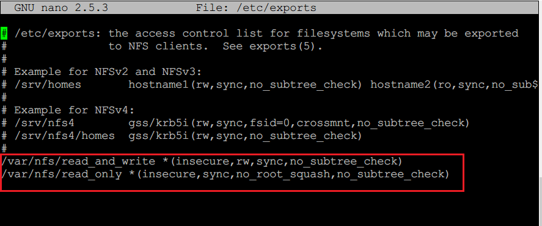
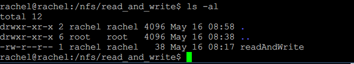
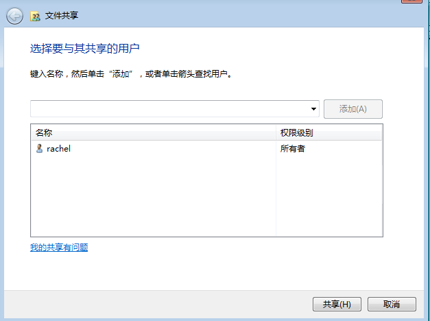
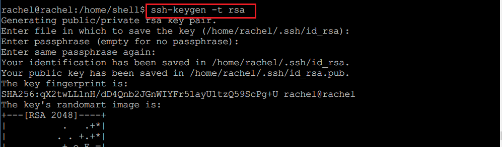

#第六章：FTP、NFS、DHCP、DNS、Samba服务器的自动安装与自动配置

## 实验过程

### 一、服务器配置

* **proftpd **

  * 安装

    * `apt install proftpd`

  * 配置一个提供匿名访问的FTP服务器，匿名访问者可以访问1个目录且仅拥有该目录及其所有子目录的只读访问权限；

    * 修改`/etc/proftpd/proftpd.conf`
      * ```shell
        <Anonymous ~ftp>  
        User                                 rachel
        Group                                rachel
        # We want clients to be able to login with "anonymous" as well as "ftp"
        UserAlias                    anonymous rachel
        <Directory *>
        <Limit WRITE>
                DenyAll
        </Limit>
        </Directory>
        </Anonymous>
        ```

      * 效果

        * 

* 配置一个支持用户名和密码方式访问的账号，该账号继承匿名访问者所有权限，且拥有对另1个独立目录及其子目录完整读写（包括创建目录、修改文件、删除文件等）权限；

* 修改`/etc/proftpd/proftpd.conf`


*  ```shell
     AuthOrder               mod_auth_file.c  mod_auth_unix.c
     AuthUserFile /etc/proftpd/ftpd.passwd
     AuthUserFile /etc/proftpd/ftpd.group
     ```

  * 添加ftp虚拟用户

    * ```shell
      # 添加ftp虚拟用户ftp_passwd 使用与rachel相同的uid 目录为/home/ftp 
      sudo ftpasswd --passwd --file=/etc/proftpd/ftpd.passwd --name=passwd_test --uid=1000 --home=/home/passwd_test --shell=/sbin/nologin
      # 创建虚拟用户组
      sudo ftpasswd --group --file=/etc/proftpd/ftpd.group --name=passwdtest_group --gid=1000
      # 添加虚拟用户进组
      sudo ftpasswd --group --name=passwdtest_group --gid=99 --member=passwd_test
      ```

  * 添加linux同名用户

    * ```
      sudo useradd passwd_test
      sudo passwd passwd_test
      ```

  * 效果

    * 

* FTP用户不能越权访问指定目录之外的任意其他目录和文件

  * `DefaultRoot               ~`

* 匿名访问权限仅限白名单IP来源用户访问，禁止白名单IP以外的访问；

  * 修改配置文件

    * anonymous模块中加入

    * ```shell
      <Limit LOGIN ~ftp/*>
      Order allow,deny
      Allow from 192.168.137.207
      Deny from all
      </Limit>
      ```


* **NFS**

  * 在1台Linux上配置NFS服务，另1台电脑上配置NFS客户端挂载2个权限不同的共享目录，分别对应只读访问和读写访问权限；
    * server:192.168.137.207
    * client:192.168.137.132
    * server端安装 ：`apt install nfs-kernel-server`
    * client端安装：`apt install nfs-common`
    * 修改server端的文件`/etc/exports`
    * client挂载server端的目录
      * /etc/exports文件配置
        * `/var/nfs/common 192.168.137.207(rw,sync,no_subtree_check)`
        * 报错：`mount.nfs: access denied by server while mounting`
        * 解决方案
          * 添加insecure选项，ip地址改为
          * `/var/nfs/common *(insecure,rw,sync,no_subtree_check)`
          * 并且客户机和服务器使用同名用户，确保其有两个共享的文件夹（挂载的文件夹和被挂载的文件夹）及其子文件的读写权限
        * 配置文件/etc/exports
          * 
        * 挂载
          * 
          * 
        * 权限
          * 
          * 
    * 记录在NFS客户端上看到的：
      - 共享目录中文件、子目录的属主、权限信息
        - client
          - 
        - server
          - 
      - 通过NFS客户端在NFS共享目录中新建的目录、创建的文件的属主、权限信息
        - client
          - 
        - server
          - 
      - 上述共享目录中文件、子目录的属主、权限信息和在NFS服务器端上查看到的信息一样吗？无论是否一致，请给出你查到的资料是如何讲解NFS目录中的属主和属主组信息应该如何正确解读？
        - 二者属主、权限信息完全相同。猜测是由于为了不使挂载时出错，我手动将所有文件夹的权限修改为了当前用户。

* **DHCP **

  * 2台虚拟机使用Internal网络模式连接，其中一台虚拟机上配置DHCP服务，另一台服务器作为DHCP客户端，从该DHCP服务器获取网络地址配置

    * client端配置

      * 

    * server端配置

      * 

      	server	

      * 安装`apt-get install isc-dhcp-server`

      * 修改/etc/network/interfaces

        * ```
           auto enp0s8
           iface enp0s8 inet static
           address 10.5.5.2
           netmask 255.255.255.0
           gateway 10.0.5.2
           ```

      * 修改/etc/default/isc-dhcp-server

        * `INTERFACES="enp0s8"`

      * 修改/etc/dhcp/dhcpd.conf

        * ```shell
          subnet 10.5.5.0 netmask 255.255.255.224 {
             range 10.5.5.26 10.5.5.30;
             option domain-name-servers ns1.internal.example.org;
             option domain-name "internal.example.org";
             option subnet-mask 255.255.255.224;
             option routers 10.5.5.1;
             option broadcast-address 10.5.5.31;
             default-lease-time 600;
             max-lease-time 7200;
            }
          ```

      * 开启isc-dhcp-server服务` sudo /etc/init.d/isc-dhcp-server start`

    * client

      * `sudo dhclient enp0s8`

    * 效果

    * 配置前

      * 

    * 配置后

      * 

* **DNS **

  * 基于上述Internal网络模式连接的虚拟机实验环境，在DHCP服务器上配置DNS服务，使得另一台作为DNS客户端的主机可以通过该DNS服务器进行DNS查询

  * server

    * `sudo apt install bind9`

    * `sudo apt install dnsutils`

    * 配置/etc/bind/named.conf.local

      * ```
        zone "cuc.edu.cn"{
        type master;
        file "/etc/bind/db.cuc.edu.cn";
        }
        ```

    * 配置/etc/bind/db.cuc.edu.cn

      * ```
        @       IN      SOA     cuc.edu.cn. admin.cuc.edu.cn. (
                                       2         ; Serial
                                  604800         ; Refresh
                                   86400         ; Retry
                                 2419200         ; Expire
                                  604800 )       ; Negative Cache TTL
         ;
         @       IN      NS      localhost.
         @       IN      A       127.0.0.1
         @       IN      AAAA    ::1
        ```

  * client

    * `dig wp.sec.cuc.edu.cn`
    * 

* **Samba**

  * linux客户端安装
    * `sudo apt-get install smbclient`
  * windows系统设置共享文件
    * 匿名共享文件
      * 添加无密码的windows用户`anonymous_user`
      * 关闭密码保护
        * 
      * 添加文件共享
        * 
      * 匿名访问共享目录
        * 
    * 用户名密码共享文件
      * 文件夹共享情况
        * 
      * 用有密码的windows用户`rachel` 登录
      * 
  * [文件下载](https://indradjy.wordpress.com/2010/04/14/getting-whole-folder-using-smbclient/)
    * 

### 二、shell脚本编程

* 脚本已上传，使用的是expect语句，将本地的配置文件直接使用scp传送到远程服务器
* ssh配置免密登录
  * 安装
    - `sudo apt-get install ssh `
  * 启动服务
    - `/etc/init.d/ssh start`
  * server端
    * 
    * 
    * 
* 主要问题
  * dhcp的自动安装
    * 由于目标机器的网卡名未知，如果直接将配置文件/etc/network/interfaces拷贝过去，可能导致网络无法使用，进而影响dhcp的服务
    * 目前还未想到解决办法
    * 目前的虚拟机中，网卡名称相同。


## 环境配置过程中遇到的问题及解决方案

* **proftpd**
  * 配置用户名密码登录的ftp账号，尝试连接时提示530 Login incorrect
    * 添加与虚拟ftp用户同名的linux用户
* **Samba**

  * 登录报错`NT_STATUS_ACCESS_DENIED`
    * 只能使用windows管理员用户登录，即使是普通用户具有对文件夹的全部控制权限也不可以
    * 关闭密码保护
  * 连接问题
    * 虚拟机和宿主机之间使用的是host-only网卡
    * 虚拟机使用samba访问宿主机的共享文件夹时，只能通过名字来访问，不能通过ip
    * 虚拟机使用samba client访问另一台windows7的虚拟机共享文件夹时，只能通过ip，不能通过名字

    * 尝试过的解决bug的方法(有效性待定)
      * samba添加与windows共享文件夹属主同名的用户 
        - 需要linux主机添加同用户名，但是linux和samba的用户密码不能相同
      * 修改samba配置文件中的[global]项
        - 修改 `map to guest = bad password`
        - 添加`netbios name = somethinglessthan15chars`
* **DHCP**
  * 添加静态ip后，网络服务重启失败
    * [bug参考链接](https://askubuntu.com/questions/824376/failed-to-start-raise-network-interfaces-after-upgrading-to-16-04)